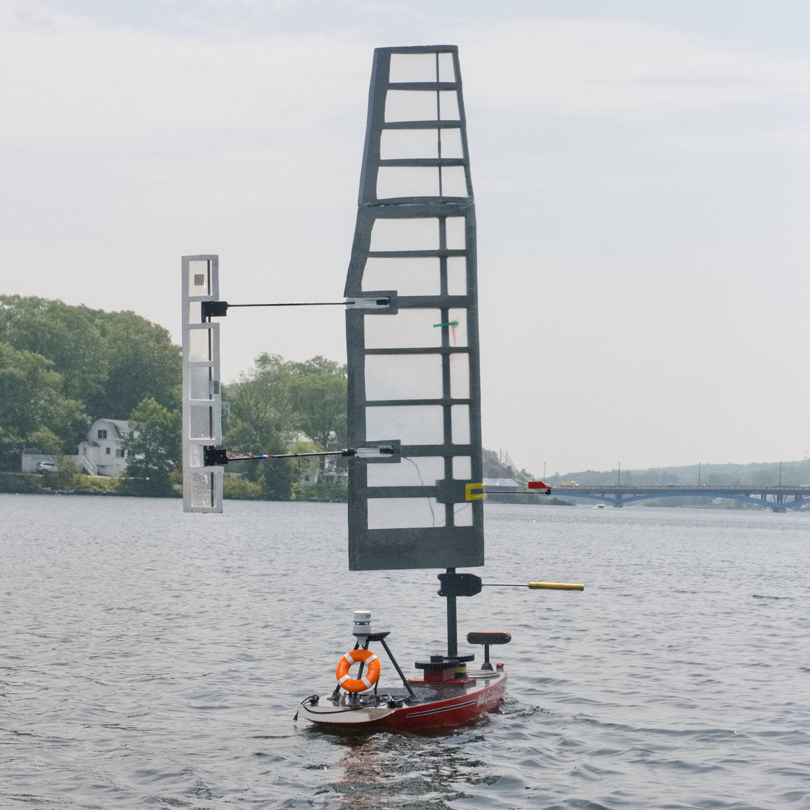

## Project Overview  
Improved an autonomous sailing robot for my senior capstone project (Major Qualifying Project) at WPI.  
- Designed a new main hull PCB with a custom Battery Management System (BMS), voltage monitoring, using connections for both a Jetson Orin Nano and ESP32 co-processor.
- Assisted in CAM/manufacturing of a new wingsail to improve performance and reliability.
- Integrated ROS2 running on Ubuntu 22.04 with kernel modifications to support a legacy 4G LTE modem.
- Enabled wireless communication between the main hull and free-rotating wing sail using ESP32 microcontrollers.
- Competed in the 2025 International Robotic Sailing Regatta, placing **2nd overall**.  

---

## Abstract (from MQP Paper)  
> This Major Qualifying Project presents the design, development, and testing of an autonomous robotic sailboat for the 2024–2025 International Robotic Sailing Regatta. Building on the foundation laid by previous WPI SailBot teams, the project focused on enhancing performance, reliability, and usability through mechanical, electrical, and software improvements. Key contributions include a redesigned wingsail with improved aerodynamic control and modularity, the addition of a passive rotational damping system, and modified rudders for improved low-speed maneuverability. Electrical upgrades addressed feedback sensing, power management, and the integration of a reliable magnetic power switch. On the software side, enhancements to computer vision, telemetry robustness, and control interfaces improved autonomy and operability. Comprehensive testing validated these systems, and the project demonstrates continued advancement in robotic sailing platforms.

- 🌎 [Digital WPI Published Paper](https://digital.wpi.edu/concern/student_works/kd17cz447)
- 📄 [Full MQP Paper (PDF)](https://digital.wpi.edu/downloads/9z903467w?locale=en)

---

