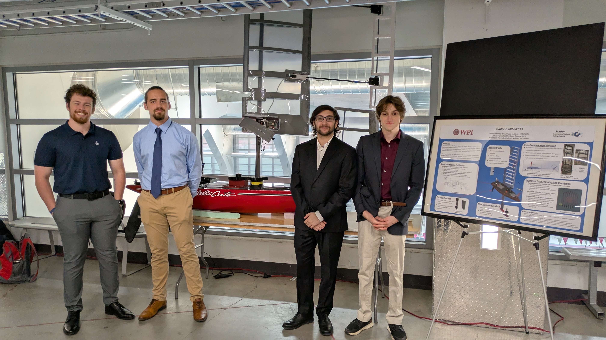

<figure>
  
  <figcaption class="text-center">
    WPI SailBot MQP team at the 2025 Undergraduate Research Projects Showcase (URPS).  
    From left: Gavin Tingley, James Purnell, Max Berman, Bryce McKinley.
  </figcaption>
</figure>

## Project Overview  
Improved an autonomous sailing robot for my senior capstone project (Major Qualifying Project) at WPI.  
- Designed a new main hull PCB with a custom Battery Management System (BMS), voltage monitoring, using connections for both a Jetson Orin Nano and ESP32 co-processor.
- Assisted in CAM/manufacturing of a new wingsail to improve performance and reliability.
- Integrated ROS2 running on Ubuntu 22.04 with kernel modifications to support a legacy 4G LTE modem.
- Enabled wireless communication between the main hull and free-rotating wing sail using ESP32 microcontrollers.
- Competed in the 2025 International Robotic Sailing Regatta, placing **2nd overall**.  

---

## Abstract (from MQP Paper)  
> This Major Qualifying Project presents the design, development, and testing of an autonomous robotic sailboat for the 2024–2025 International Robotic Sailing Regatta. Building on the foundation laid by previous WPI SailBot teams, the project focused on enhancing performance, reliability, and usability through mechanical, electrical, and software improvements. Key contributions include a redesigned wingsail with improved aerodynamic control and modularity, the addition of a passive rotational damping system, and modified rudders for improved low-speed maneuverability. Electrical upgrades addressed feedback sensing, power management, and the integration of a reliable magnetic power switch. On the software side, enhancements to computer vision, telemetry robustness, and control interfaces improved autonomy and operability. Comprehensive testing validated these systems, and the project demonstrates continued advancement in robotic sailing platforms.

### Main Project Links:
- 🌎 [Digital WPI Published Paper](https://digital.wpi.edu/concern/student_works/kd17cz447)
- 📄 [Full MQP Paper (PDF)](https://digital.wpi.edu/downloads/9z903467w?locale=en)
- 💻 [WPI SailBot GitHub Organization](https://github.com/wpisailbot)
- ⛵ [SailBot Competition Website](https://www.sailbot.org/)

---

## Making the New Wingsail

### CAM in Fusion 360
<figure class="my-3">
  
  <figcaption class="text-muted text-center mt-2">
    CAM toolpaths created in Fusion 360 for wingsail ribs and spar pockets.
  </figcaption>
</figure>

### CNC Manufacturing (ShopSabre)
<figure class="my-3">
  <video
    class="w-100 rounded shadow-sm"
    controls
    playsinline
    preload="metadata"
    poster="{{ site.baseurl }}/img/sailbot/sailbot-ribs-1inch-CAM.png">
    <source src="{{ site.baseurl }}/img/sailbot/sailbot-machiningribs.mp4" type="video/mp4">
    Your browser does not support the video tag. You can <a href="{{ site.baseurl }}/img/sailbot/sailbot-machiningribs.MOV">download the .MOV</a> instead.
  </video>
  <figcaption class="text-muted text-center mt-2">
    Machining ribs on the Shopsabre CNC using toolpaths generated in Fusion 360.
  </figcaption>
</figure>

### Wrap & Assembly Timelapse
<figure class="my-3">
  <video
    class="w-100 rounded shadow-sm"
    controls
    autoplay
    muted
    loop
    playsinline
    preload="metadata"
    poster="{{ site.baseurl }}/img/sailbot/sailbot-ribs-1inch-CAM.png">
    <source src="{{ site.baseurl }}/img/sailbot/sailbot-wrappingsail.mp4" type="video/mp4">
    Your browser does not support the video tag. You can <a href="{{ site.baseurl }}/img/sailbot/sailbot-wrappingsail.MOV">download the .MOV</a>.
  </video>
  <figcaption class="text-muted text-center mt-2">
    Timelapse of the MQP team wrapping the assembled wingsail.
  </figcaption>
</figure>

---

**Process Notes (Highlights)**
- Defined toolpaths for rib profiles Fusion 360.
- Verified stock setup and safe Z heights; simulated tool engagement prior to machining.
- Machined ribs on a Shopsabre CNC.
- Wrapped and heat-shrunk assembled wingsail with MonoCote.

